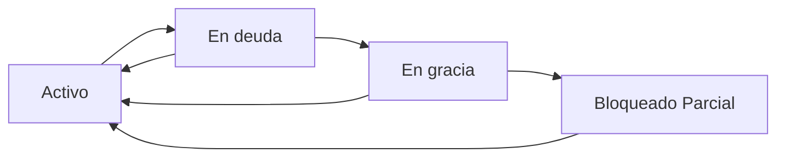

# Sistema de Gestión de Vencimientos Mensuales

## Descripción General

Este sistema implementa una lógica completa de vencimientos mensuales con gestión de pagos manual (preparado para integración automática futura). Incluye estados de gracia, bloqueos parciales y rehabilitación automática.

## 📋 Funcionalidades Implementadas

### 1. Estructura de Base de Datos

#### Nuevos campos en tabla `users`:
- `fecha_inicio_suscripcion`: Fecha del primer pago
- `dia_vencimiento`: Día fijo de vencimiento mensual (ej: 10)
- `ultimo_pago`: Última fecha de pago registrada
- `estado_suscripcion`: Activo, En deuda, En gracia, Bloqueado Parcial
- `fecha_proximo_vencimiento`: Próxima fecha de vencimiento
- `dias_gracia_restantes`: Días restantes en período de gracia

#### Nueva tabla `payment_history`:
- Historial completo de pagos para auditoría
- Tracking de cambios de estado
- Preparado para métodos automáticos

#### Nueva tabla `subscription_notifications`:
- Sistema de notificaciones automáticas
- Diferentes tipos: preventivo, vencimiento, gracia, suspensión

### 2. Lógica de Estados



#### Estados y Reglas:

- **Activo**: Al día con el pago, acceso completo
- **En deuda**: Vencimiento alcanzado, inicia período de gracia
- **En gracia**: 7 días con acceso completo + contador regresivo
- **Bloqueado Parcial**: QR/link público deshabilitado, panel accesible

### 3. Cálculo de Vencimientos

- **Día fijo mensual**: Se establece en el primer pago
- **Próximo vencimiento**: Siempre basado en el día original
- **Ejemplo**: Pago 10/09 → Siempre vence día 10 de cada mes
- **Rehabilitación**: Pago 15/09 → Próximo vencimiento sigue siendo 10/10

## 🔧 APIs Implementadas

### Gestión de Pagos
```http
POST /api/admin/payments
GET /api/admin/payments?userId=123
```

### Estado de Suscripción
```http
GET /api/subscription/status?userId=123
PUT /api/subscription/status (actualizar todos los estados)
```

### Verificación QR Público
```http
GET /api/public/store/[storeId]
```

### Administración
```http
GET /api/admin/users (lista con estados de suscripción)
```

## 🎨 Componentes de UI

### Para Usuarios
- `SubscriptionStatusComponent`: Estado actual y alertas
- Integrado en user dashboard con alertas visuales

### Para Administradores
- `PaymentRegistrationComponent`: Registro manual de pagos
- `SubscriptionManagementPage`: Panel completo de gestión
- Lista de usuarios con estados y filtros

## 💻 Uso del Sistema

### 1. Registrar un Pago (Admin)

```typescript
// Navegador: /admin-dashboard/subscriptions
// Rellenar formulario:
// - ID Usuario: 123
// - Fecha Pago: 2025-09-15  
// - Monto: 20000.00
```

### 2. Verificar Estado (Usuario)

El componente `SubscriptionStatusComponent` se muestra automáticamente en el dashboard del usuario y muestra:

- Estado actual con íconos de colores
- Días restantes si está en gracia
- Próximo vencimiento
- Alertas contextuales
- Historial de pagos (si disponible)

### 3. Actualización Automática

```bash
# Script manual
node scripts/update-subscription-states.js

# Cron job (diario a las 00:01)
1 0 * * * cd /path/to/project && node scripts/update-subscription-states.js
```

## 📅 Flujo de Ejemplo

### Usuario con alta el 10/09:

1. **10/09**: Paga → Estado: `Activo`
2. **10/10**: No paga → Estado: `En deuda` (7 días de gracia)
3. **11-17/10**: Estado: `En gracia` (contador regresivo)
4. **18/10**: Estado: `Bloqueado Parcial` (QR deshabilitado)
5. **20/10**: Paga → Estado: `Activo` (próximo vencimiento: 10/11)

## 🔔 Sistema de Notificaciones

### Tipos de Notificaciones:

1. **Preventivo** (5 días antes): "Tu suscripción vence en 5 días"
2. **Vencimiento** (día D): "Tu suscripción ha vencido"
3. **Gracia** (días 1-7): "Te quedan X días antes del bloqueo"
4. **Suspensión** (día 8+): "QR deshabilitado, regulariza tu pago"

### Generación Automática:
- Script diario genera notificaciones pendientes
- No duplica notificaciones del mismo día
- Mensajes contextuales según estado

## 🚀 Escalabilidad Futura

### Integración con Pasarela de Pago:

```typescript
// Función existente que se ejecutará automáticamente
await SubscriptionManager.registrarPago(
  userId, 
  fechaPago, 
  monto
)
```

### Webhooks Preparados:
- La estructura soporta `metodo_pago: 'automatico'`
- Historial de pagos incluye origen del pago
- Estados se actualizan automáticamente

## 🛡️ Seguridad y Validaciones

### Acceso QR Público:
```typescript
// Middleware automático en /api/public/store/[storeId]
const puedeAcceder = await puedeAccederQR(userId)
if (!puedeAcceder) {
  return "Tienda temporalmente no disponible"
}
```

### Permisos:
- Solo admins pueden registrar pagos
- Usuarios ven su propio estado
- QR público respeta estados de suscripción

## 🔧 Configuración y Deployment

### Variables de Entorno:
```env
DB_HOST=localhost
DB_USER=root
DB_PASSWORD=yourpassword
DB_NAME=pedi_solutions
DB_PORT=3306
```

### Migración de Base de Datos:
```sql
-- Ejecutar script
source scripts/03-subscription-management-schema.sql
```

### Cron Job Setup:
```bash
# Agregar a crontab
crontab -e

# Agregar línea:
1 0 * * * cd /path/to/pedi_solutions && node scripts/update-subscription-states.js >> logs/subscription-updates.log 2>&1
```

## 📊 Monitoreo y Reportes

### Métricas Disponibles:
- Estados de suscripción por usuario
- Historial completo de pagos
- Notificaciones enviadas
- Estadísticas de recaudación

### Dashboards:
- `/admin-dashboard/subscriptions`: Gestión completa
- `/user-dashboard`: Estado personal con alertas
- Reportes exportables (futuro)

## 🐛 Troubleshooting

### Problemas Comunes:

1. **QR no funciona**: Verificar estado de suscripción del propietario
2. **Estados no actualizan**: Ejecutar script manual o verificar cron
3. **Pagos no registran**: Verificar permisos de admin
4. **Fechas incorrectas**: Validar formato YYYY-MM-DD

### Logs Importantes:
```bash
# Ver logs de actualización
tail -f logs/subscription-updates.log

# Ver logs de API
# (en consola del navegador o logs del servidor)
```

## 📈 Roadmap Futuro

### Próximas Funcionalidades:
- [ ] Integración con MercadoPago/Stripe
- [ ] Notificaciones por email/WhatsApp
- [ ] Dashboard de analytics avanzado
- [ ] Reportes de recaudación
- [ ] Planes de suscripción variables
- [ ] Descuentos y promociones
- [ ] API para webhooks externos

### Mejoras Técnicas:
- [ ] Tests automatizados
- [ ] Documentación API completa
- [ ] Optimizaciones de performance
- [ ] Backup automático de datos
- [ ] Monitoreo de uptime
